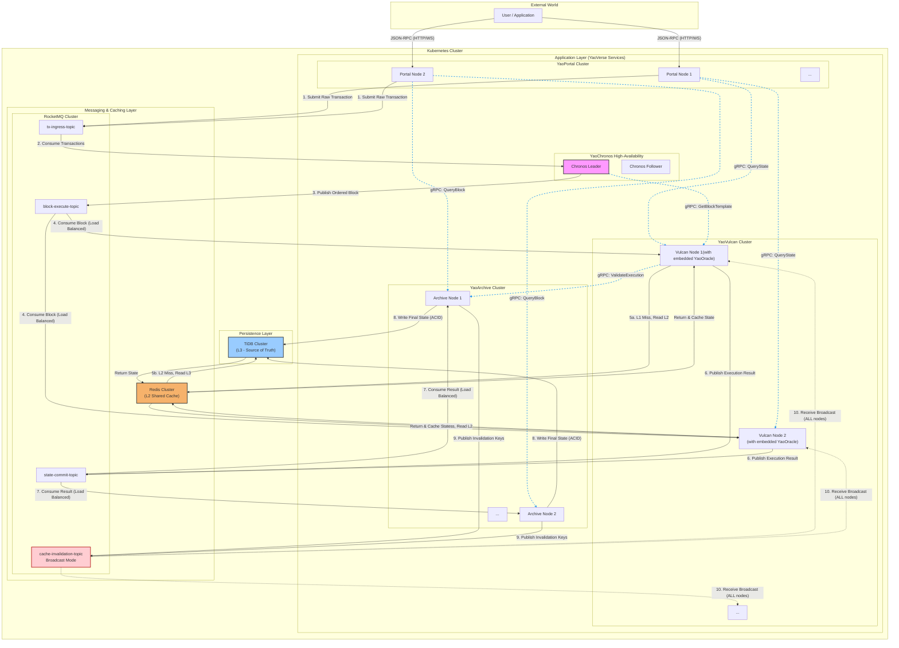
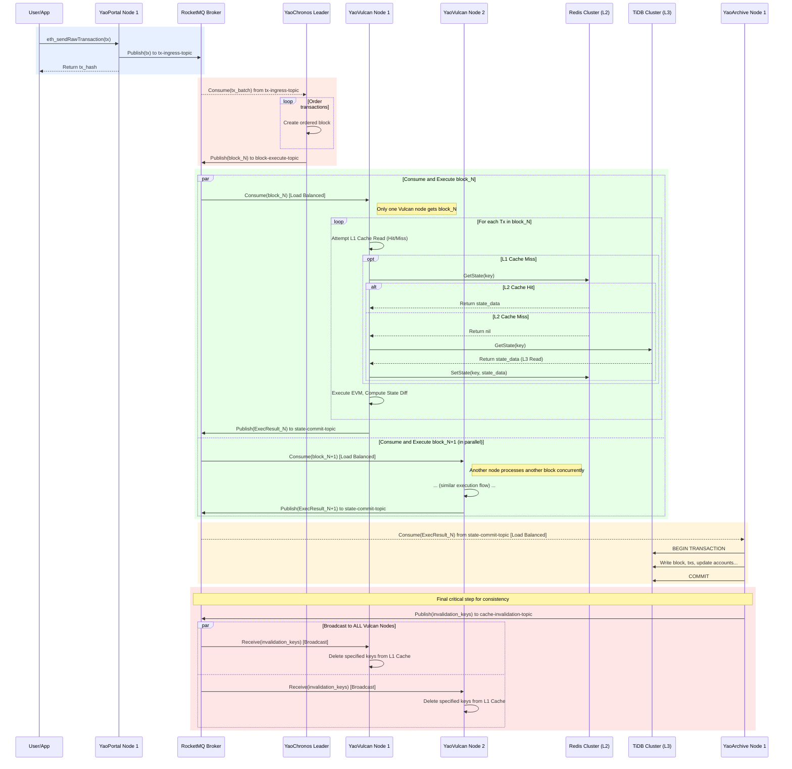
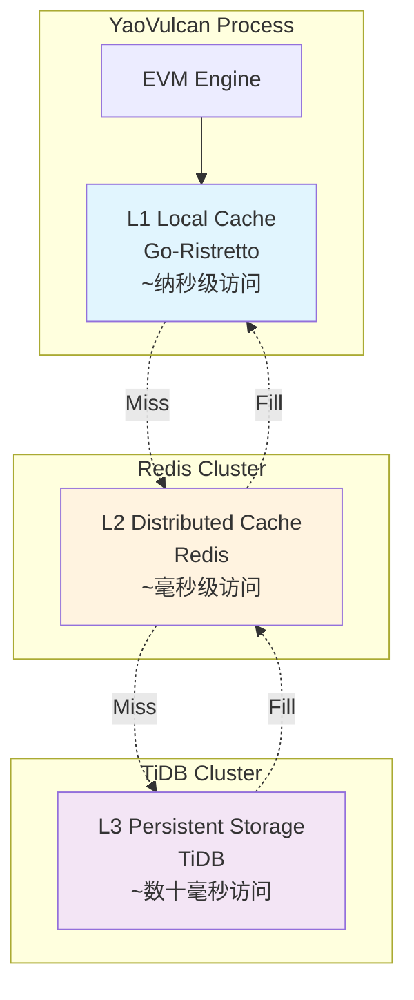

# YaoVerse 系统架构

## 概述

YaoVerse采用现代微服务架构，通过职责分离、gRPC同步通信和异步消息传递实现高性能区块链处理。本文档详细描述了系统的架构设计、数据流向和关键技术决策。

## 架构原则

### 1. 中心化信任 (Centralized Trust)
在所有节点均可信的私有环境中，我们摒弃了复杂的拜占庭容错（BFT）共识算法。系统的确定性与一致性由唯一的**中心化序列器 (YaoChronos)**保障。

### 2. 职责分离 (Separation of Duties)  
系统被解耦为独立的微服务组件，各自承担明确的职责，通过高性能gRPC同步通信和消息队列异步协作。

### 3. 计算与存储分离 (Compute-Storage Separation)
执行节点被设计为无状态单元，系统状态统一由分布式数据库持久化，实现独立的水平扩展。

### 4. 混合通信模式 (Hybrid Communication)
- **gRPC同步通信**: 用于组件间的直接调用、状态查询和实时数据交换
- **消息队列异步通信**: RocketMQ作为系统"神经网络"，处理核心业务流程，实现异步解耦和削峰填谷

### 5. 简化存储 (Simplified Storage)
抛弃以太坊原生的MPT树结构，采用关系型数据库存储所有区块链数据，极大简化数据读写逻辑。

### 6. 标准化日志 (Standardized Logging)
所有组件统一使用自研日志库，确保日志格式一致性和可观测性。

## 系统架构图



**图例说明**：
- 实线：消息队列异步通信
- 虚线：gRPC同步通信
- 蓝色虚线：gRPC调用

## 核心组件

### 1. YaoPortal (曜阙) - API网关

**职责**:
- 提供以太坊兼容的JSON-RPC接口
- 交易验证和初始处理
- 负载均衡和限流控制
- 只读查询路由和gRPC调用聚合

**关键特性**:
- 完全兼容以太坊JSON-RPC协议
- 支持WebSocket和HTTP连接
- 内置连接池和请求缓存
- 实时交易状态跟踪

**gRPC服务**:
- `StateService`: 提供账户状态和合约存储查询
- `BlockService`: 提供区块和交易信息查询
- `HealthService`: 健康检查和服务发现

### 2. YaoChronos (曜史) - 中心化序列器

**职责**:
- 全局唯一的交易排序
- 区块构建和分发
- 系统确定性保障
- 高可用性管理

**关键特性**:
- Leader-Follower高可用模式
- 基于Kubernetes Lease的选举机制
- 多种交易排序策略
- 可配置的区块参数

**gRPC服务**:
- `SequencerService`: 交易排序和区块构建
- `ConsensusService`: 共识状态查询
- `ConfigService`: 动态配置管理

### 3. YaoVulcan (曜焱) - 执行节点集群

**职责**:
- EVM智能合约执行
- 区块并行处理
- 状态变更计算
- 缓存同步管理

**关键特性**:
- 内置高性能EVM引擎
- 嵌入式YaoOracle状态库
- 支持水平扩展
- 实时缓存失效处理

**gRPC服务**:
- `ExecutionService`: 区块执行和状态计算
- `StateService`: 状态查询和缓存管理
- `OracleService`: YaoOracle状态访问接口

### 4. YaoArchive (曜典) - 持久化服务

**职责**:
- 区块链数据持久化
- ACID事务保障
- 状态最终确认
- 缓存失效通知

**关键特性**:
- 原子性数据写入
- 支持事务回滚
- 精确的缓存失效
- 数据完整性校验

**gRPC服务**:
- `StorageService`: 数据持久化和查询
- `ValidationService`: 数据完整性验证
- `BackupService`: 数据备份和恢复

## 数据流详解

### 交易处理流程



## 存储架构

### 三级缓存系统 (YaoOracle)



### 数据模型

YaoVerse使用简化的关系型数据模型替代复杂的MPT树：

```sql
-- 区块表
CREATE TABLE blocks (
    number BIGINT PRIMARY KEY,
    hash CHAR(66) UNIQUE NOT NULL,
    parent_hash CHAR(66) NOT NULL,
    timestamp BIGINT NOT NULL,
    gas_limit BIGINT NOT NULL,
    gas_used BIGINT NOT NULL,
    state_root CHAR(66) NOT NULL,
    receipt_hash CHAR(66) NOT NULL,
    created_at TIMESTAMP DEFAULT CURRENT_TIMESTAMP
);

-- 交易表
CREATE TABLE transactions (
    hash CHAR(66) PRIMARY KEY,
    block_number BIGINT NOT NULL,
    block_hash CHAR(66) NOT NULL,
    transaction_index INT NOT NULL,
    from_address CHAR(42) NOT NULL,
    to_address CHAR(42),
    value DECIMAL(78,0) NOT NULL,
    gas_limit BIGINT NOT NULL,
    gas_price DECIMAL(78,0) NOT NULL,
    data LONGBLOB,
    nonce BIGINT NOT NULL,
    v DECIMAL(78,0) NOT NULL,
    r CHAR(66) NOT NULL,
    s CHAR(66) NOT NULL,
    INDEX idx_block_number (block_number),
    INDEX idx_from_address (from_address),
    INDEX idx_to_address (to_address)
);

-- 账户表
CREATE TABLE accounts (
    address CHAR(42) PRIMARY KEY,
    nonce BIGINT NOT NULL DEFAULT 0,
    balance DECIMAL(78,0) NOT NULL DEFAULT 0,
    code_hash CHAR(66) NOT NULL DEFAULT '0xc5d2460186f7233c927e7db2dcc703c0e500b653ca82273b7bfad8045d85a470',
    storage_root CHAR(66) NOT NULL DEFAULT '0x56e81f171bcc55a6ff8345e692c0f86e5b48e01b996cadc001622fb5e363b421',
    updated_at TIMESTAMP DEFAULT CURRENT_TIMESTAMP ON UPDATE CURRENT_TIMESTAMP,
    INDEX idx_balance (balance),
    INDEX idx_updated_at (updated_at)
);

-- 合约存储表
CREATE TABLE contract_storage (
    address CHAR(42) NOT NULL,
    storage_key CHAR(66) NOT NULL,
    storage_value CHAR(66) NOT NULL,
    block_number BIGINT NOT NULL,
    PRIMARY KEY (address, storage_key),
    INDEX idx_address (address),
    INDEX idx_block_number (block_number)
);

-- 交易回执表
CREATE TABLE receipts (
    transaction_hash CHAR(66) PRIMARY KEY,
    transaction_index INT NOT NULL,
    block_hash CHAR(66) NOT NULL,
    block_number BIGINT NOT NULL,
    from_address CHAR(42) NOT NULL,
    to_address CHAR(42),
    gas_used BIGINT NOT NULL,
    cumulative_gas_used BIGINT NOT NULL,
    contract_address CHAR(42),
    status TINYINT NOT NULL,
    effective_gas_price DECIMAL(78,0) NOT NULL,
    logs_bloom BLOB NOT NULL,
    INDEX idx_block_number (block_number),
    INDEX idx_from_address (from_address),
    INDEX idx_to_address (to_address)
);

-- 事件日志表
CREATE TABLE logs (
    id BIGINT AUTO_INCREMENT PRIMARY KEY,
    address CHAR(42) NOT NULL,
    topic0 CHAR(66),
    topic1 CHAR(66),
    topic2 CHAR(66),  
    topic3 CHAR(66),
    data LONGBLOB,
    block_number BIGINT NOT NULL,
    block_hash CHAR(66) NOT NULL,
    transaction_hash CHAR(66) NOT NULL,
    transaction_index INT NOT NULL,
    log_index INT NOT NULL,
    removed BOOLEAN NOT NULL DEFAULT FALSE,
    INDEX idx_address (address),
    INDEX idx_topic0 (topic0),
    INDEX idx_topic1 (topic1),
    INDEX idx_block_number (block_number),
    INDEX idx_tx_hash (transaction_hash)
);
```

## 消息队列设计

### RocketMQ Topic 设计

| Topic | 消费模式 | 用途 | 消费者组 |
|-------|---------|------|----------|
| `tx-ingress-topic` | 集群消费 | 交易提交 | `yao-chronos-group` |
| `block-execute-topic` | 集群消费 | 区块执行 | `yao-vulcan-group` |
| `state-commit-topic` | 集群消费 | 状态提交 | `yao-archive-group` |
| `cache-invalidation-topic` | 广播消费 | 缓存失效 | 所有YaoVulcan节点 |

### 消息格式

所有消息都包含标准的元数据字段：

```go
type BaseMessage struct {
    Type      MessageType `json:"type"`
    MessageID string      `json:"messageId"`
    Timestamp time.Time   `json:"timestamp"`
    Version   string      `json:"version"`
}
```

## gRPC协议设计

### 服务接口定义

YaoVerse采用标准的Go语言gRPC实现，所有组件间通信都基于Protocol Buffers定义。以下是核心服务接口：

```protobuf
// YaoPortal State Service
service StateService {
    rpc GetAccount(GetAccountRequest) returns (GetAccountResponse);
    rpc GetBalance(GetBalanceRequest) returns (GetBalanceResponse);
    rpc GetStorageAt(GetStorageAtRequest) returns (GetStorageAtResponse);
    rpc GetCode(GetCodeRequest) returns (GetCodeResponse);
    rpc EstimateGas(EstimateGasRequest) returns (EstimateGasResponse);
}

// YaoPortal Block Service  
service BlockService {
    rpc GetBlockByNumber(GetBlockByNumberRequest) returns (GetBlockByNumberResponse);
    rpc GetBlockByHash(GetBlockByHashRequest) returns (GetBlockByHashResponse);
    rpc GetTransaction(GetTransactionRequest) returns (GetTransactionResponse);
    rpc GetTransactionReceipt(GetTransactionReceiptRequest) returns (GetTransactionReceiptResponse);
}

// YaoChronos Sequencer Service
service SequencerService {
    rpc SubmitTransaction(SubmitTransactionRequest) returns (SubmitTransactionResponse);
    rpc GetPendingTransactions(GetPendingTransactionsRequest) returns (GetPendingTransactionsResponse);
    rpc GetBlockTemplate(GetBlockTemplateRequest) returns (GetBlockTemplateResponse);
}

// YaoVulcan Execution Service
service ExecutionService {
    rpc ExecuteBlock(ExecuteBlockRequest) returns (ExecuteBlockResponse);
    rpc ValidateTransaction(ValidateTransactionRequest) returns (ValidateTransactionResponse);
    rpc SimulateTransaction(SimulateTransactionRequest) returns (SimulateTransactionResponse);
}

// YaoArchive Storage Service
service StorageService {
    rpc StoreBlock(StoreBlockRequest) returns (StoreBlockResponse);
    rpc StoreReceipts(StoreReceiptsRequest) returns (StoreReceiptsResponse);
    rpc GetHistoricalState(GetHistoricalStateRequest) returns (GetHistoricalStateResponse);
}
```

### gRPC通信特性

1. **连接复用**: 使用HTTP/2的多路复用特性，单连接处理多并发请求
2. **流式处理**: 支持Server Streaming，用于实时数据推送和大数据传输
3. **负载均衡**: 基于grpc-go的客户端负载均衡，支持轮询和加权轮询
4. **超时控制**: 所有gRPC调用都设置合理的超时时间和重试策略
5. **TLS加密**: 生产环境强制启用mTLS双向认证

### 服务发现

基于Kubernetes DNS的服务发现机制：

```go
// gRPC客户端连接示例
conn, err := grpc.Dial("yao-vulcan-service:50051", 
    grpc.WithTransportCredentials(creds),
    grpc.WithDefaultServiceConfig(`{
        "loadBalancingConfig": [{"round_robin":{}}],
        "retryPolicy": {
            "maxAttempts": 3,
            "initialBackoff": "1s",
            "maxBackoff": "10s"
        }
    }`))
```

## 统一日志系统 (YaoLogger)

### 设计目标

YaoVerse自研的统一日志库确保所有组件的日志格式一致性，便于监控、调试和审计。

### 日志格式标准

```json
{
  "timestamp": "2024-01-15T10:30:45.123Z",
  "level": "INFO", 
  "service": "yao-portal",
  "instance": "yao-portal-7d4f8b9c-xyz",
  "trace_id": "550e8400-e29b-41d4-a716-446655440000",
  "span_id": "6ba7b810-9dad-11d1-80b4-00c04fd430c8",
  "component": "json_rpc_handler",
  "method": "eth_sendRawTransaction", 
  "message": "Transaction submitted successfully",
  "fields": {
    "tx_hash": "0xabcd...",
    "from": "0x1234...",
    "gas_limit": 21000,
    "gas_price": "20000000000"
  },
  "duration_ms": 45,
  "error": null
}
```

### 日志级别

| 级别 | 用途 | 示例场景 |
|------|------|----------|
| **DEBUG** | 详细调试信息 | 函数调用参数、状态变更细节 |
| **INFO** | 正常业务流程 | 交易处理、区块生成、服务启动 |
| **WARN** | 警告但可继续 | 缓存未命中、连接重试、配置异常 |
| **ERROR** | 错误需要关注 | 交易执行失败、数据库连接失败 |
| **FATAL** | 致命错误退出 | 服务无法启动、关键组件失败 |

### 使用示例

```go
// 初始化logger
logger := yaolog.NewLogger(&yaolog.Config{
    Service:     "yao-portal",
    Level:       yaolog.INFO,
    Format:      yaolog.JSON,
    Output:      yaolog.STDOUT,
    TracingMode: true,
})

// 业务日志记录
logger.Info("Processing transaction").
    WithField("tx_hash", txHash).
    WithField("from", fromAddr).
    WithDuration(startTime).
    Log()

// 错误日志记录
logger.Error("Failed to execute transaction").
    WithField("tx_hash", txHash).
    WithError(err).
    WithField("block_number", blockNum).
    Log()

// 性能日志记录
timer := logger.Timer("block_execution")
// ... 执行业务逻辑
timer.Record("Block executed successfully").
    WithField("block_number", blockNum).
    WithField("tx_count", len(txs)).
    Log()
```

### 日志聚合和分析

1. **日志收集**: 通过Filebeat收集容器日志
2. **日志处理**: Logstash进行日志解析和格式化
3. **日志存储**: Elasticsearch存储结构化日志
4. **日志查询**: Kibana提供可视化查询界面
5. **告警监控**: 基于日志内容的实时告警

## 高可用性设计

### 组件高可用

1. **YaoPortal**: 无状态，支持水平扩展
2. **YaoChronos**: Leader-Follower模式，自动故障切换
3. **YaoVulcan**: 无状态计算节点，支持动态扩缩容
4. **YaoArchive**: 无状态持久化服务，支持负载均衡

### 数据高可用

1. **TiDB**: 基于Raft协议，自动数据复制和故障转移
2. **Redis**: 集群模式，主从复制和自动故障转移
3. **RocketMQ**: 主从复制，保证消息可靠性

### 监控和告警

- **健康检查**: 每个组件都提供gRPC和HTTP健康检查接口
- **指标监控**: Prometheus + Grafana监控系统，集成gRPC调用指标
- **日志聚合**: 基于YaoLogger的ELK Stack统一日志管理
- **链路追踪**: 分布式链路追踪系统，支持gRPC调用追踪
- **实时告警**: 基于日志内容和gRPC调用异常的实时告警机制

## 性能优化

### 缓存策略

1. **L1缓存**: 进程内缓存，纳秒级访问
2. **L2缓存**: Redis集群，毫秒级访问  
3. **L3存储**: TiDB，数十毫秒访问
4. **智能预热**: 自动识别热点数据并预加载

### 并发处理

1. **无状态设计**: 所有计算节点无状态，支持无限水平扩展
2. **异步处理**: 基于消息队列的异步处理模型
3. **gRPC连接池**: 高效的gRPC连接复用和负载均衡
4. **负载均衡**: 智能负载均衡，避免热点问题
5. **批处理**: 支持批量处理提升吞吐量
6. **流式处理**: 利用gRPC Server Streaming处理大数据传输

### 存储优化

1. **索引优化**: 针对查询模式优化的数据库索引
2. **分区策略**: 基于时间和哈希的数据分区
3. **压缩存储**: 历史数据压缩存储
4. **归档策略**: 冷数据自动归档

## 安全考虑

### 网络安全

1. **内网部署**: 系统部署在隔离的内网环境
2. **TLS加密**: 所有外部通信使用TLS加密
3. **mTLS认证**: gRPC服务间通信使用双向TLS认证
4. **访问控制**: 基于IP白名单的访问控制
5. **防火墙**: 严格的网络防火墙规则
6. **gRPC拦截器**: 统一的认证和授权拦截器

### 数据安全

1. **数据加密**: 敏感数据静态加密存储
2. **访问审计**: 完整的数据访问审计日志
3. **备份策略**: 定期数据备份和恢复测试
4. **完整性校验**: 数据完整性定期校验

### 应用安全

1. **输入验证**: 严格的输入数据验证
2. **权限控制**: 基于角色的访问控制(RBAC)
3. **代码审计**: 定期代码安全审计
4. **漏洞修复**: 及时的安全漏洞修复

## 通信模式选择指南

### gRPC同步通信使用场景

**适用于**:
- **实时查询**: 账户余额查询、区块信息查询
- **状态验证**: 交易验证、智能合约调用模拟
- **配置管理**: 动态配置更新、服务发现
- **健康检查**: 服务状态检查、可用性探测
- **跨服务调用**: 需要立即响应的业务逻辑

**优势**:
- 低延迟、高性能
- 强类型接口定义
- 自动负载均衡和重试
- 内建的错误处理机制

### 消息队列异步通信使用场景

**适用于**:
- **核心业务流程**: 交易处理、区块执行、状态持久化
- **事件驱动**: 缓存失效通知、状态变更广播
- **削峰填谷**: 处理高并发交易提交
- **解耦组件**: 降低服务间的紧耦合
- **可靠性保障**: 需要消息持久化和重试的场景

**优势**:
- 高可靠性和持久化
- 自然的削峰填谷能力
- 组件间松耦合
- 支持广播和负载均衡消费

### 选择原则

1. **延迟要求**: 低延迟需求选择gRPC，可容忍延迟选择消息队列
2. **可靠性要求**: 关键业务流程使用消息队列确保可靠性
3. **耦合程度**: 紧耦合场景使用gRPC，松耦合场景使用消息队列
4. **数据一致性**: 需要严格顺序的操作使用消息队列串行处理

---

本架构文档会随着系统演进持续更新，请关注版本变更。 