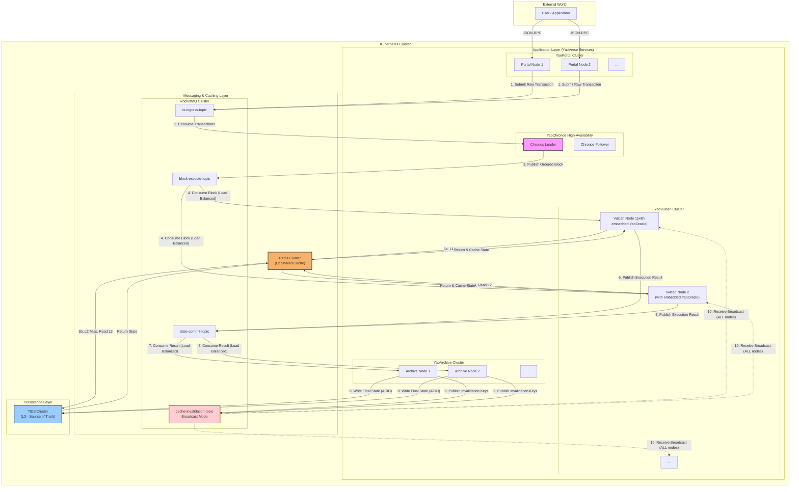
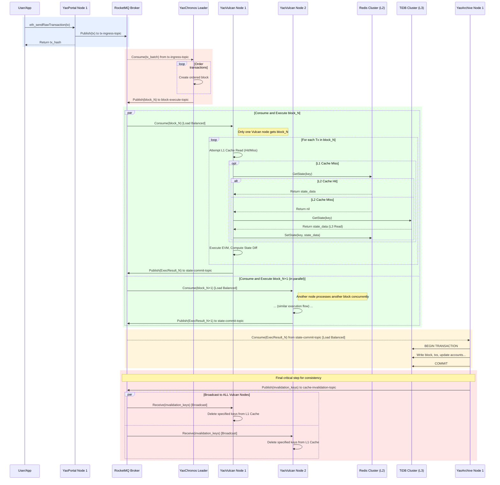
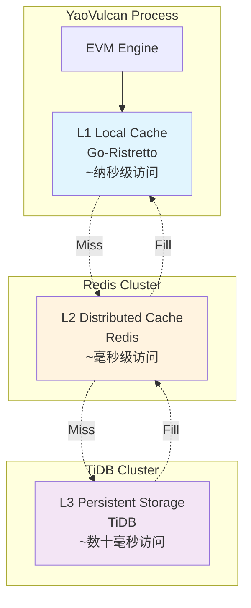

# YaoVerse 系统架构

## 概述

YaoVerse采用现代微服务架构，通过职责分离和异步消息传递实现高性能区块链处理。本文档详细描述了系统的架构设计、数据流向和关键技术决策。

## 架构原则

### 1. 中心化信任 (Centralized Trust)
在所有节点均可信的私有环境中，我们摒弃了复杂的拜占庭容错（BFT）共识算法。系统的确定性与一致性由唯一的**中心化序列器 (YaoChronos)**保障。

### 2. 职责分离 (Separation of Duties)  
系统被解耦为独立的微服务组件，各自承担明确的职责，通过高性能消息队列异步协作。

### 3. 计算与存储分离 (Compute-Storage Separation)
执行节点被设计为无状态单元，系统状态统一由分布式数据库持久化，实现独立的水平扩展。

### 4. 消息驱动 (Message-Driven)
RocketMQ消息队列是系统的"神经网络"，所有核心流程都由消息驱动，实现异步解耦和削峰填谷。

### 5. 简化存储 (Simplified Storage)
抛弃以太坊原生的MPT树结构，采用关系型数据库存储所有区块链数据，极大简化数据读写逻辑。

## 系统架构图



## 核心组件

### 1. YaoPortal (曜阙) - API网关

**职责**:
- 提供以太坊兼容的JSON-RPC接口
- 交易验证和初始处理
- 负载均衡和限流控制
- 只读查询路由

**关键特性**:
- 完全兼容以太坊JSON-RPC协议
- 支持WebSocket和HTTP连接
- 内置连接池和请求缓存
- 实时交易状态跟踪

### 2. YaoChronos (曜史) - 中心化序列器

**职责**:
- 全局唯一的交易排序
- 区块构建和分发
- 系统确定性保障
- 高可用性管理

**关键特性**:
- Leader-Follower高可用模式
- 基于Kubernetes Lease的选举机制
- 多种交易排序策略
- 可配置的区块参数

### 3. YaoVulcan (曜焱) - 执行节点集群

**职责**:
- EVM智能合约执行
- 区块并行处理
- 状态变更计算
- 缓存同步管理

**关键特性**:
- 内置高性能EVM引擎
- 嵌入式YaoOracle状态库
- 支持水平扩展
- 实时缓存失效处理

### 4. YaoArchive (曜典) - 持久化服务

**职责**:
- 区块链数据持久化
- ACID事务保障
- 状态最终确认
- 缓存失效通知

**关键特性**:
- 原子性数据写入
- 支持事务回滚
- 精确的缓存失效
- 数据完整性校验

## 数据流详解

### 交易处理流程



## 存储架构

### 三级缓存系统 (YaoOracle)



### 数据模型

YaoVerse使用简化的关系型数据模型替代复杂的MPT树：

```sql
-- 区块表
CREATE TABLE blocks (
    number BIGINT PRIMARY KEY,
    hash CHAR(66) UNIQUE NOT NULL,
    parent_hash CHAR(66) NOT NULL,
    timestamp BIGINT NOT NULL,
    gas_limit BIGINT NOT NULL,
    gas_used BIGINT NOT NULL,
    state_root CHAR(66) NOT NULL,
    receipt_hash CHAR(66) NOT NULL,
    created_at TIMESTAMP DEFAULT CURRENT_TIMESTAMP
);

-- 交易表
CREATE TABLE transactions (
    hash CHAR(66) PRIMARY KEY,
    block_number BIGINT NOT NULL,
    block_hash CHAR(66) NOT NULL,
    transaction_index INT NOT NULL,
    from_address CHAR(42) NOT NULL,
    to_address CHAR(42),
    value DECIMAL(78,0) NOT NULL,
    gas_limit BIGINT NOT NULL,
    gas_price DECIMAL(78,0) NOT NULL,
    data LONGBLOB,
    nonce BIGINT NOT NULL,
    v DECIMAL(78,0) NOT NULL,
    r CHAR(66) NOT NULL,
    s CHAR(66) NOT NULL,
    INDEX idx_block_number (block_number),
    INDEX idx_from_address (from_address),
    INDEX idx_to_address (to_address)
);

-- 账户表
CREATE TABLE accounts (
    address CHAR(42) PRIMARY KEY,
    nonce BIGINT NOT NULL DEFAULT 0,
    balance DECIMAL(78,0) NOT NULL DEFAULT 0,
    code_hash CHAR(66) NOT NULL DEFAULT '0xc5d2460186f7233c927e7db2dcc703c0e500b653ca82273b7bfad8045d85a470',
    storage_root CHAR(66) NOT NULL DEFAULT '0x56e81f171bcc55a6ff8345e692c0f86e5b48e01b996cadc001622fb5e363b421',
    updated_at TIMESTAMP DEFAULT CURRENT_TIMESTAMP ON UPDATE CURRENT_TIMESTAMP,
    INDEX idx_balance (balance),
    INDEX idx_updated_at (updated_at)
);

-- 合约存储表
CREATE TABLE contract_storage (
    address CHAR(42) NOT NULL,
    storage_key CHAR(66) NOT NULL,
    storage_value CHAR(66) NOT NULL,
    block_number BIGINT NOT NULL,
    PRIMARY KEY (address, storage_key),
    INDEX idx_address (address),
    INDEX idx_block_number (block_number)
);

-- 交易回执表
CREATE TABLE receipts (
    transaction_hash CHAR(66) PRIMARY KEY,
    transaction_index INT NOT NULL,
    block_hash CHAR(66) NOT NULL,
    block_number BIGINT NOT NULL,
    from_address CHAR(42) NOT NULL,
    to_address CHAR(42),
    gas_used BIGINT NOT NULL,
    cumulative_gas_used BIGINT NOT NULL,
    contract_address CHAR(42),
    status TINYINT NOT NULL,
    effective_gas_price DECIMAL(78,0) NOT NULL,
    logs_bloom BLOB NOT NULL,
    INDEX idx_block_number (block_number),
    INDEX idx_from_address (from_address),
    INDEX idx_to_address (to_address)
);

-- 事件日志表
CREATE TABLE logs (
    id BIGINT AUTO_INCREMENT PRIMARY KEY,
    address CHAR(42) NOT NULL,
    topic0 CHAR(66),
    topic1 CHAR(66),
    topic2 CHAR(66),  
    topic3 CHAR(66),
    data LONGBLOB,
    block_number BIGINT NOT NULL,
    block_hash CHAR(66) NOT NULL,
    transaction_hash CHAR(66) NOT NULL,
    transaction_index INT NOT NULL,
    log_index INT NOT NULL,
    removed BOOLEAN NOT NULL DEFAULT FALSE,
    INDEX idx_address (address),
    INDEX idx_topic0 (topic0),
    INDEX idx_topic1 (topic1),
    INDEX idx_block_number (block_number),
    INDEX idx_tx_hash (transaction_hash)
);
```

## 消息队列设计

### RocketMQ Topic 设计

| Topic | 消费模式 | 用途 | 消费者组 |
|-------|---------|------|----------|
| `tx-ingress-topic` | 集群消费 | 交易提交 | `yao-chronos-group` |
| `block-execute-topic` | 集群消费 | 区块执行 | `yao-vulcan-group` |
| `state-commit-topic` | 集群消费 | 状态提交 | `yao-archive-group` |
| `cache-invalidation-topic` | 广播消费 | 缓存失效 | 所有YaoVulcan节点 |

### 消息格式

所有消息都包含标准的元数据字段：

```go
type BaseMessage struct {
    Type      MessageType `json:"type"`
    MessageID string      `json:"messageId"`
    Timestamp time.Time   `json:"timestamp"`
    Version   string      `json:"version"`
}
```

## 高可用性设计

### 组件高可用

1. **YaoPortal**: 无状态，支持水平扩展
2. **YaoChronos**: Leader-Follower模式，自动故障切换
3. **YaoVulcan**: 无状态计算节点，支持动态扩缩容
4. **YaoArchive**: 无状态持久化服务，支持负载均衡

### 数据高可用

1. **TiDB**: 基于Raft协议，自动数据复制和故障转移
2. **Redis**: 集群模式，主从复制和自动故障转移
3. **RocketMQ**: 主从复制，保证消息可靠性

### 监控和告警

- **健康检查**: 每个组件都提供健康检查接口
- **指标监控**: Prometheus + Grafana监控系统
- **日志聚合**: ELK Stack统一日志管理
- **链路追踪**: 分布式链路追踪系统

## 性能优化

### 缓存策略

1. **L1缓存**: 进程内缓存，纳秒级访问
2. **L2缓存**: Redis集群，毫秒级访问  
3. **L3存储**: TiDB，数十毫秒访问
4. **智能预热**: 自动识别热点数据并预加载

### 并发处理

1. **无状态设计**: 所有计算节点无状态，支持无限水平扩展
2. **异步处理**: 基于消息队列的异步处理模型
3. **负载均衡**: 智能负载均衡，避免热点问题
4. **批处理**: 支持批量处理提升吞吐量

### 存储优化

1. **索引优化**: 针对查询模式优化的数据库索引
2. **分区策略**: 基于时间和哈希的数据分区
3. **压缩存储**: 历史数据压缩存储
4. **归档策略**: 冷数据自动归档

## 安全考虑

### 网络安全

1. **内网部署**: 系统部署在隔离的内网环境
2. **TLS加密**: 所有外部通信使用TLS加密
3. **访问控制**: 基于IP白名单的访问控制
4. **防火墙**: 严格的网络防火墙规则

### 数据安全

1. **数据加密**: 敏感数据静态加密存储
2. **访问审计**: 完整的数据访问审计日志
3. **备份策略**: 定期数据备份和恢复测试
4. **完整性校验**: 数据完整性定期校验

### 应用安全

1. **输入验证**: 严格的输入数据验证
2. **权限控制**: 基于角色的访问控制(RBAC)
3. **代码审计**: 定期代码安全审计
4. **漏洞修复**: 及时的安全漏洞修复

---

本架构文档会随着系统演进持续更新，请关注版本变更。 