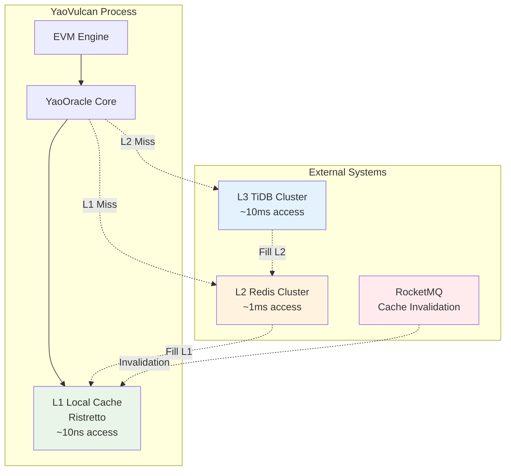

# YaoOracle 状态库组件

## 概述

YaoOracle是YaoVerse系统的核心创新之一，它是一个嵌入式的三级缓存状态库，为EVM执行提供极致性能的状态访问能力。通过精心设计的多级缓存架构和实时缓存同步机制，YaoOracle将状态读取延迟从毫秒级降低到纳秒级，是YaoVerse实现高性能的关键技术。

## 设计理念

### 核心挑战

在传统区块链系统中，EVM执行期间需要频繁读取账户状态、合约存储等数据。即使是访问Redis这样的内存数据库，每次网络往返也需要几毫秒的延迟。当一笔复杂交易需要数百次状态读取时，累积的网络延迟将成为性能瓶颈。

### 解决方案

YaoOracle采用三级缓存架构来解决这一问题：

```
EVM执行引擎
    ↓ 纳秒级访问
L1本地缓存 (Go-Ristretto)
    ↓ 毫秒级访问 (Miss时)
L2分布式缓存 (Redis Cluster)
    ↓ 数十毫秒访问 (Miss时)
L3持久化存储 (TiDB Cluster)
```

### 关键特性

1. **极致性能**: L1缓存提供纳秒级的进程内访问
2. **智能缓存**: 自动识别热点数据并预加载
3. **实时同步**: 基于RocketMQ的精确缓存失效机制
4. **水平扩展**: 支持动态增减YaoVulcan节点
5. **故障恢复**: 任一级别故障都不影响数据一致性

## 架构设计

### 三级缓存架构



### 数据流程

#### 读取流程

1. **L1查询**: EVM请求状态 → YaoOracle首先检查L1本地缓存
2. **L1命中**: 直接返回数据（纳秒级）
3. **L1未命中**: 查询L2 Redis集群
4. **L2命中**: 返回数据并填充L1缓存（毫秒级）
5. **L2未命中**: 查询L3 TiDB数据库
6. **L3命中**: 返回数据并依次填充L2和L1缓存（数十毫秒级）

#### 写入流程

1. **状态变更**: EVM执行产生状态变更
2. **批量写入**: YaoArchive将变更批量写入TiDB
3. **失效通知**: YaoArchive发布缓存失效消息到RocketMQ
4. **精确失效**: 所有YaoVulcan节点接收广播，精确删除L1缓存中的过期数据

### 缓存一致性保证

YaoOracle通过以下机制保证缓存一致性：

1. **单一写入点**: 只有YaoArchive可以写入L3存储
2. **原子性写入**: 使用数据库事务保证写入原子性
3. **精确失效**: 基于State Diff生成精确的失效键列表
4. **实时广播**: 通过RocketMQ广播模式实现实时失效通知
5. **故障容错**: 任何缓存故障都会回退到下一级别

## 接口定义

### 核心接口

YaoOracle实现了以下主要接口：

```go
// YaoOracle 主接口
type YaoOracle interface {
    StateDB              // 状态数据库接口
    CacheManager         // 缓存管理接口
    
    // 生命周期管理
    Initialize(ctx context.Context, config *OracleConfig) error
    Start(ctx context.Context) error
    Stop(ctx context.Context) error
    Close() error
    
    // 高级功能
    GetStorage() L3Storage
    ExecuteInTransaction(ctx context.Context, fn func(StateDB) error) error
    GetStateDiff(beforeSnapshot, afterSnapshot int) *types.StateDiff
    ApplyStateDiff(ctx context.Context, stateDiff *types.StateDiff) error
    GetCacheInvalidationHandler() types.MessageHandler
    GetMetrics() *OracleMetrics
}
```

### 状态访问接口

```go
// StateReader 状态读取接口
type StateReader interface {
    GetAccount(ctx context.Context, address common.Address) (*types.Account, error)
    GetBalance(ctx context.Context, address common.Address) (*big.Int, error)
    GetNonce(ctx context.Context, address common.Address) (uint64, error)
    GetCode(ctx context.Context, address common.Address) ([]byte, error)
    GetCodeHash(ctx context.Context, address common.Address) (common.Hash, error)
    GetStorageAt(ctx context.Context, address common.Address, key common.Hash) (common.Hash, error)
    HasAccount(ctx context.Context, address common.Address) (bool, error)
    IsContract(ctx context.Context, address common.Address) (bool, error)
}

// StateWriter 状态写入接口
type StateWriter interface {
    SetAccount(ctx context.Context, address common.Address, account *types.Account) error
    SetBalance(ctx context.Context, address common.Address, balance *big.Int) error
    SetNonce(ctx context.Context, address common.Address, nonce uint64) error
    SetCode(ctx context.Context, address common.Address, code []byte) error
    SetStorageAt(ctx context.Context, address common.Address, key, value common.Hash) error
    DeleteAccount(ctx context.Context, address common.Address) error
    CreateAccount(ctx context.Context, address common.Address) error
}
```

### 缓存管理接口

```go
// CacheManager 缓存管理接口
type CacheManager interface {
    // L1 缓存操作
    GetFromL1(key string) (interface{}, bool)
    SetToL1(key string, value interface{}) error
    DeleteFromL1(key string) error
    ClearL1() error
    GetL1Stats() *CacheStats
    
    // L2 缓存操作
    GetFromL2(ctx context.Context, key string) (interface{}, error)
    SetToL2(ctx context.Context, key string, value interface{}) error
    DeleteFromL2(ctx context.Context, key string) error
    ClearL2(ctx context.Context) error
    GetL2Stats() *CacheStats
    
    // 缓存失效
    InvalidateKeys(ctx context.Context, keys []*types.CacheKey) error
    
    // 缓存预热
    WarmupCache(ctx context.Context) error
    
    // 健康检查
    HealthCheck(ctx context.Context) error
}
```

## 配置选项

### 基础配置

```go
type OracleConfig struct {
    // L1 缓存配置
    L1CacheSize int `json:"l1CacheSize"`  // L1缓存大小(字节)
    L1CacheTTL  int `json:"l1CacheTtl"`   // L1缓存TTL(秒)
    
    // L2 缓存配置 (Redis)
    RedisEndpoints []string `json:"redisEndpoints"`
    RedisPassword  string   `json:"redisPassword"`
    RedisDB        int      `json:"redisDb"`
    RedisPoolSize  int      `json:"redisPoolSize"`
    L2CacheTTL     int      `json:"l2CacheTtl"`
    
    // L3 存储配置 (TiDB)
    TiDBDSN         string `json:"tidbDsn"`
    TiDBMaxOpenConn int    `json:"tidbMaxOpenConn"`
    TiDBMaxIdleConn int    `json:"tidbMaxIdleConn"`
    TiDBMaxLifetime int    `json:"tidbMaxLifetime"`
    
    // 缓存预热配置
    EnableCacheWarming bool     `json:"enableCacheWarming"`
    WarmupAccounts     []string `json:"warmupAccounts"`
    
    // 消息队列配置
    RocketMQEndpoints []string `json:"rocketmqEndpoints"`
    RocketMQAccessKey string   `json:"rocketmqAccessKey"`
    RocketMQSecretKey string   `json:"rocketmqSecretKey"`
    
    // 性能调优
    BatchSize       int  `json:"batchSize"`
    EnableMetrics   bool `json:"enableMetrics"`
    MetricsInterval int  `json:"metricsInterval"`
}
```

### 配置示例

```yaml
# oracle-config.yml
oracle:
  # L1本地缓存配置
  l1CacheSize: 134217728      # 128MB
  l1CacheTtl: 300             # 5分钟
  
  # L2 Redis集群配置
  redisEndpoints:
    - "redis-1:6379"
    - "redis-2:6379"  
    - "redis-3:6379"
  redisPassword: "your-redis-password"
  redisDb: 0
  redisPoolSize: 100
  l2CacheTtl: 1800            # 30分钟
  
  # L3 TiDB配置
  tidbDsn: "root:@tcp(tidb-server:4000)/yaoverse?charset=utf8mb4&parseTime=true"
  tidbMaxOpenConn: 50
  tidbMaxIdleConn: 10
  tidbMaxLifetime: 3600       # 1小时
  
  # 缓存预热配置
  enableCacheWarming: true
  warmupAccounts:
    - "0x1234567890123456789012345678901234567890"
    - "0x0987654321098765432109876543210987654321"
  
  # RocketMQ配置
  rocketmqEndpoints:
    - "rocketmq-namesrv-1:9876"
    - "rocketmq-namesrv-2:9876"
  rocketmqAccessKey: "your-access-key"
  rocketmqSecretKey: "your-secret-key"
  
  # 性能配置
  batchSize: 100
  enableMetrics: true
  metricsInterval: 30
```

## 使用示例

### 基础用法

```go
package main

import (
    "context"
    "fmt"
    "math/big"
    
    "github.com/ethereum/go-ethereum/common"
    "github.com/eggybyte-technology/yao-verse-shared/interfaces"
    "github.com/eggybyte-technology/yao-verse-shared/oracle"
)

func main() {
    // 加载配置
    config, err := loadOracleConfig("oracle-config.yml")
    if err != nil {
        panic(err)
    }
    
    // 创建Oracle实例
    oracle := oracle.NewYaoOracle()
    
    // 初始化
    ctx := context.Background()
    if err := oracle.Initialize(ctx, config); err != nil {
        panic(err)
    }
    
    // 启动后台服务
    if err := oracle.Start(ctx); err != nil {
        panic(err)
    }
    defer oracle.Stop(ctx)
    defer oracle.Close()
    
    // 使用示例
    address := common.HexToAddress("0x1234567890123456789012345678901234567890")
    
    // 读取账户余额
    balance, err := oracle.GetBalance(ctx, address)
    if err != nil {
        fmt.Printf("Error getting balance: %v\n", err)
    } else {
        fmt.Printf("Balance: %s wei\n", balance.String())
    }
    
    // 读取合约代码
    code, err := oracle.GetCode(ctx, address)
    if err != nil {
        fmt.Printf("Error getting code: %v\n", err)
    } else {
        fmt.Printf("Code length: %d bytes\n", len(code))
    }
    
    // 读取存储
    storageKey := common.HexToHash("0x0000000000000000000000000000000000000000000000000000000000000000")
    storageValue, err := oracle.GetStorageAt(ctx, address, storageKey)
    if err != nil {
        fmt.Printf("Error getting storage: %v\n", err)
    } else {
        fmt.Printf("Storage value: %s\n", storageValue.Hex())
    }
}
```

### 事务处理

```go
func processBlockWithTransaction(oracle interfaces.YaoOracle, block *types.Block) error {
    return oracle.ExecuteInTransaction(context.Background(), func(state interfaces.StateDB) error {
        for _, tx := range block.Transactions {
            // 执行交易逻辑
            if err := executeTransaction(state, tx); err != nil {
                return err // 自动回滚
            }
        }
        return nil // 自动提交
    })
}

func executeTransaction(state interfaces.StateDB, tx *types.Transaction) error {
    // 检查发送者余额
    senderBalance, err := state.GetBalance(context.Background(), tx.From)
    if err != nil {
        return err
    }
    
    totalCost := new(big.Int).Add(tx.Value, new(big.Int).Mul(big.NewInt(int64(tx.Gas)), tx.GasPrice))
    if senderBalance.Cmp(totalCost) < 0 {
        return fmt.Errorf("insufficient balance")
    }
    
    // 扣除发送者余额
    newSenderBalance := new(big.Int).Sub(senderBalance, totalCost)
    if err := state.SetBalance(context.Background(), tx.From, newSenderBalance); err != nil {
        return err
    }
    
    // 增加接收者余额
    receiverBalance, err := state.GetBalance(context.Background(), *tx.To)
    if err != nil {
        return err
    }
    
    newReceiverBalance := new(big.Int).Add(receiverBalance, tx.Value)
    if err := state.SetBalance(context.Background(), *tx.To, newReceiverBalance); err != nil {
        return err
    }
    
    return nil
}
```

### 缓存管理

```go
func manageCacheExample(oracle interfaces.YaoOracle) {
    ctx := context.Background()
    
    // 获取缓存统计信息
    l1Stats := oracle.GetL1Stats()
    l2Stats := oracle.GetL2Stats()
    
    fmt.Printf("L1 Cache - Hits: %d, Misses: %d, Hit Ratio: %.2f%%\n", 
        l1Stats.Hits, l1Stats.Misses, l1Stats.HitRatio*100)
    fmt.Printf("L2 Cache - Hits: %d, Misses: %d, Hit Ratio: %.2f%%\n", 
        l2Stats.Hits, l2Stats.Misses, l2Stats.HitRatio*100)
    
    // 手动缓存预热
    accounts := []string{
        "0x1234567890123456789012345678901234567890",
        "0x0987654321098765432109876543210987654321",
    }
    
    for _, addr := range accounts {
        address := common.HexToAddress(addr)
        
        // 预加载账户数据
        oracle.GetAccount(ctx, address)
        oracle.GetBalance(ctx, address)
        oracle.GetNonce(ctx, address)
        oracle.GetCode(ctx, address)
    }
    
    // 清理特定缓存
    if l1Stats.Usage > 0.9 { // 如果L1缓存使用率超过90%
        oracle.ClearL1() // 清空L1缓存
    }
    
    // 健康检查
    if err := oracle.HealthCheck(ctx); err != nil {
        fmt.Printf("Oracle health check failed: %v\n", err)
    }
}
```

### 指标监控

```go
func monitorOracleMetrics(oracle interfaces.YaoOracle) {
    metrics := oracle.GetMetrics()
    
    fmt.Printf("Oracle Performance Metrics:\n")
    fmt.Printf("=============================\n")
    
    // 缓存统计
    fmt.Printf("L1 Cache Hit Ratio: %.2f%%\n", metrics.L1Stats.HitRatio*100)
    fmt.Printf("L2 Cache Hit Ratio: %.2f%%\n", metrics.L2Stats.HitRatio*100)
    
    // 性能统计
    fmt.Printf("Total Requests: %d\n", metrics.TotalRequests)
    fmt.Printf("Average Response Time: %d ns\n", metrics.AverageResponseTime)
    fmt.Printf("L3 Queries: %d\n", metrics.L3Queries)
    
    // 错误统计
    fmt.Printf("Total Errors: %d\n", metrics.TotalErrors)
    fmt.Printf("Cache Errors: %d\n", metrics.CacheErrors)
    fmt.Printf("Storage Errors: %d\n", metrics.StorageErrors)
    
    // 系统统计
    fmt.Printf("Memory Usage: %d MB\n", metrics.MemoryUsage/1024/1024)
    fmt.Printf("Goroutine Count: %d\n", metrics.GoroutineCount)
    
    // 失效统计
    fmt.Printf("Invalidation Messages: %d\n", metrics.InvalidationMessages)
    fmt.Printf("Invalidated Keys: %d\n", metrics.InvalidatedKeys)
}
```

## 性能优化

### 缓存策略优化

#### 1. 热点数据识别

```go
// 实现自适应的缓存预热策略
type HotDataTracker struct {
    accessCount map[string]uint64
    mu          sync.RWMutex
}

func (h *HotDataTracker) RecordAccess(key string) {
    h.mu.Lock()
    defer h.mu.Unlock()
    h.accessCount[key]++
}

func (h *HotDataTracker) GetHotKeys(threshold uint64) []string {
    h.mu.RLock()
    defer h.mu.RUnlock()
    
    var hotKeys []string
    for key, count := range h.accessCount {
        if count >= threshold {
            hotKeys = append(hotKeys, key)
        }
    }
    return hotKeys
}
```

#### 2. 缓存大小动态调整

```go
// 根据命中率动态调整L1缓存大小
func (o *YaoOracle) adjustCacheSize() {
    stats := o.GetL1Stats()
    
    if stats.HitRatio < 0.85 && o.l1Cache.Capacity() < MaxL1CacheSize {
        // 命中率低，增加缓存大小
        newSize := o.l1Cache.Capacity() * 2
        if newSize > MaxL1CacheSize {
            newSize = MaxL1CacheSize
        }
        o.resizeL1Cache(newSize)
    } else if stats.HitRatio > 0.98 && o.l1Cache.Capacity() > MinL1CacheSize {
        // 命中率很高，可以减少缓存大小
        newSize := o.l1Cache.Capacity() / 2
        if newSize < MinL1CacheSize {
            newSize = MinL1CacheSize
        }
        o.resizeL1Cache(newSize)
    }
}
```

### 批量操作优化

```go
// 批量读取状态以减少网络开销
func (o *YaoOracle) BatchGetAccounts(ctx context.Context, addresses []common.Address) (map[common.Address]*types.Account, error) {
    results := make(map[common.Address]*types.Account)
    var missingAddresses []common.Address
    
    // 首先检查L1缓存
    for _, addr := range addresses {
        if account, found := o.getFromL1(accountKey(addr)); found {
            results[addr] = account.(*types.Account)
        } else {
            missingAddresses = append(missingAddresses, addr)
        }
    }
    
    if len(missingAddresses) == 0 {
        return results, nil
    }
    
    // 批量查询L2/L3
    missingResults, err := o.batchQueryL2L3(ctx, missingAddresses)
    if err != nil {
        return nil, err
    }
    
    // 合并结果并更新L1缓存
    for addr, account := range missingResults {
        results[addr] = account
        o.setToL1(accountKey(addr), account)
    }
    
    return results, nil
}
```

### 内存使用优化

```go
// 使用对象池减少GC压力
var accountPool = sync.Pool{
    New: func() interface{} {
        return &types.Account{}
    },
}

func (o *YaoOracle) getAccountFromPool() *types.Account {
    return accountPool.Get().(*types.Account)
}

func (o *YaoOracle) putAccountToPool(account *types.Account) {
    // 重置账户数据
    account.Address = common.Address{}
    account.Balance = nil
    account.Nonce = 0
    account.CodeHash = common.Hash{}
    account.StorageRoot = common.Hash{}
    
    accountPool.Put(account)
}
```

## 监控和诊断

### 关键指标

| 指标类别 | 指标名称 | 说明 | 目标值 |
|---------|---------|------|--------|
| 性能 | L1命中率 | L1缓存命中率 | > 95% |
| 性能 | L2命中率 | L2缓存命中率 | > 85% |
| 性能 | 平均响应时间 | 状态读取平均延迟 | < 1ms |
| 性能 | P99响应时间 | 99%请求的响应时间 | < 10ms |
| 资源 | 内存使用 | L1缓存内存占用 | < 256MB |
| 资源 | 连接数 | 数据库连接数 | < 50 |
| 错误 | 错误率 | 总请求错误比例 | < 0.1% |
| 失效 | 失效延迟 | 缓存失效传播延迟 | < 100ms |

### 监控配置

```yaml
# prometheus.yml
scrape_configs:
  - job_name: 'yao-oracle'
    static_configs:
      - targets: ['vulcan-1:9092', 'vulcan-2:9092', 'vulcan-3:9092']
    metrics_path: '/metrics'
    scrape_interval: 15s
```

### 告警规则

```yaml
# oracle-alerts.yml
groups:
  - name: yao-oracle
    rules:
      - alert: OracleL1HitRateLow
        expr: yao_oracle_l1_hit_ratio < 0.90
        for: 5m
        annotations:
          summary: "Oracle L1 cache hit ratio is low"
          description: "L1 hit ratio is {{ $value }}, below 90% threshold"
      
      - alert: OracleHighLatency
        expr: yao_oracle_response_time_p99 > 0.01  # 10ms
        for: 2m
        annotations:
          summary: "Oracle response time is high"
          description: "P99 response time is {{ $value }}s"
      
      - alert: OracleMemoryUsageHigh
        expr: yao_oracle_memory_usage_bytes > 268435456  # 256MB
        for: 5m
        annotations:
          summary: "Oracle memory usage is high"
          description: "Memory usage is {{ $value }} bytes"
```

### 日志配置

```go
// 结构化日志配置
logger := zap.NewProduction()
defer logger.Sync()

// 记录缓存访问
logger.Debug("Cache access",
    zap.String("operation", "GetAccount"),
    zap.String("address", address.Hex()),
    zap.String("cacheLevel", "L1"),
    zap.Bool("hit", hit),
    zap.Duration("duration", duration))

// 记录失效事件
logger.Info("Cache invalidation",
    zap.Uint64("blockNumber", blockNumber),
    zap.Int("keysCount", len(keys)),
    zap.Duration("propagationDelay", delay))

// 记录错误
logger.Error("Storage query failed",
    zap.Error(err),
    zap.String("query", "GetAccount"),
    zap.String("address", address.Hex()),
    zap.Int("retryCount", retryCount))
```

## 故障排除

### 常见问题

#### 1. 缓存命中率低

**症状**: L1或L2缓存命中率持续低于目标值

**可能原因**:
- 缓存大小不足
- 数据访问模式不规律
- 失效过于频繁

**解决方法**:
```bash
# 检查缓存使用情况
curl -s http://vulcan:9092/api/v1/cache/stats | jq

# 调整缓存大小
curl -X PUT http://vulcan:9092/api/v1/config \
  -H "Content-Type: application/json" \
  -d '{"l1CacheSize": 268435456}'

# 分析访问模式
curl -s http://vulcan:9092/api/v1/metrics/json | \
  jq '.oracleMetrics.accessPatterns'
```

#### 2. 响应时间过长

**症状**: 状态读取响应时间超过目标值

**诊断步骤**:
```go
func diagnoseLongResponseTime(oracle interfaces.YaoOracle) {
    metrics := oracle.GetMetrics()
    
    // 检查各级缓存性能
    fmt.Printf("L1 hit ratio: %.2f%%\n", metrics.L1Stats.HitRatio*100)
    fmt.Printf("L2 hit ratio: %.2f%%\n", metrics.L2Stats.HitRatio*100)
    fmt.Printf("L3 average query time: %dms\n", metrics.AverageResponseTime/1000000)
    
    // 检查慢查询
    if metrics.L3Queries > 0 {
        fmt.Printf("L3 queries ratio: %.2f%%\n", 
            float64(metrics.L3Queries)/float64(metrics.TotalRequests)*100)
    }
}
```

#### 3. 内存使用过高

**症状**: Oracle占用内存超过配置限制

**解决方法**:
```go
// 手动触发内存清理
func performMemoryCleanup(oracle interfaces.YaoOracle) {
    // 清理L1缓存
    oracle.ClearL1()
    
    // 手动GC
    runtime.GC()
    
    // 记录清理后的内存使用
    var m runtime.MemStats
    runtime.ReadMemStats(&m)
    log.Printf("Memory usage after cleanup: %d MB", m.Alloc/1024/1024)
}
```

#### 4. 缓存失效延迟

**症状**: 缓存失效消息传播延迟过长

**检查步骤**:
```bash
# 检查RocketMQ状态
curl -s http://rocketmq-console:8080/cluster/list.query

# 检查消息堆积
curl -s http://vulcan:9092/api/v1/status | \
  jq '.performance.cacheInvalidationDelay'

# 手动触发失效
curl -X POST http://vulcan:9092/api/v1/cache/clear \
  -H "Content-Type: application/json" \
  -d '{"level": "l1", "keys": ["account-0x1234..."]}'
```

## 最佳实践

### 1. 配置调优

```yaml
# 生产环境推荐配置
oracle:
  # 根据可用内存调整L1缓存大小
  l1CacheSize: 268435456  # 256MB
  l1CacheTtl: 300         # 5分钟
  
  # Redis连接池大小根据并发量调整
  redisPoolSize: 100      # 支持100个并发连接
  
  # TiDB连接数保持适中，避免连接数过多
  tidbMaxOpenConn: 20
  tidbMaxIdleConn: 5
  
  # 启用批量操作提升性能
  batchSize: 50
  
  # 启用详细指标监控
  enableMetrics: true
  metricsInterval: 30
```

### 2. 缓存预热策略

```go
// 系统启动时预热关键账户
func warmupCriticalAccounts(oracle interfaces.YaoOracle) error {
    ctx := context.Background()
    
    // 预热系统合约
    systemContracts := []string{
        "0x0000000000000000000000000000000000000001", // ecrecover
        "0x0000000000000000000000000000000000000002", // sha256
        "0x0000000000000000000000000000000000000003", // ripemd160
    }
    
    // 预热热点账户（从历史数据分析得出）
    hotAccounts := getHotAccountsFromHistory()
    
    allAccounts := append(systemContracts, hotAccounts...)
    
    for _, addrStr := range allAccounts {
        addr := common.HexToAddress(addrStr)
        
        // 预加载账户基本信息
        oracle.GetAccount(ctx, addr)
        oracle.GetBalance(ctx, addr)
        oracle.GetNonce(ctx, addr)
        oracle.GetCode(ctx, addr)
        
        // 如果是合约，预加载常用存储槽
        if isContract(addr) {
            commonStorageKeys := getCommonStorageKeys(addr)
            for _, key := range commonStorageKeys {
                oracle.GetStorageAt(ctx, addr, key)
            }
        }
    }
    
    return nil
}
```

### 3. 监控和告警

```go
// 实现自定义健康检查
func (o *YaoOracle) HealthCheck(ctx context.Context) error {
    // 检查缓存性能
    l1Stats := o.GetL1Stats()
    if l1Stats.HitRatio < 0.8 {
        return fmt.Errorf("L1 cache hit ratio too low: %.2f%%", l1Stats.HitRatio*100)
    }
    
    // 检查存储连接
    if err := o.storage.Ping(ctx); err != nil {
        return fmt.Errorf("storage health check failed: %w", err)
    }
    
    // 检查Redis连接
    if err := o.redis.Ping(ctx).Err(); err != nil {
        return fmt.Errorf("redis health check failed: %w", err)
    }
    
    return nil
}

// 定期执行健康检查
func startHealthMonitor(oracle interfaces.YaoOracle) {
    ticker := time.NewTicker(30 * time.Second)
    defer ticker.Stop()
    
    for range ticker.C {
        if err := oracle.HealthCheck(context.Background()); err != nil {
            log.Printf("Health check failed: %v", err)
            // 触发告警
            alertManager.Send("oracle_health_check_failed", err.Error())
        }
    }
}
```

---

YaoOracle作为YaoVerse的核心创新，通过精心设计的三级缓存架构实现了极致的性能表现。正确配置和使用YaoOracle对整个系统的性能至关重要。 