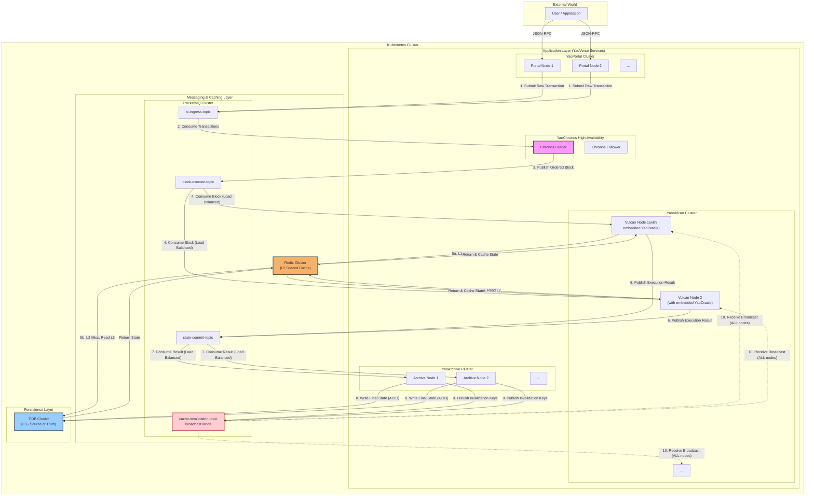
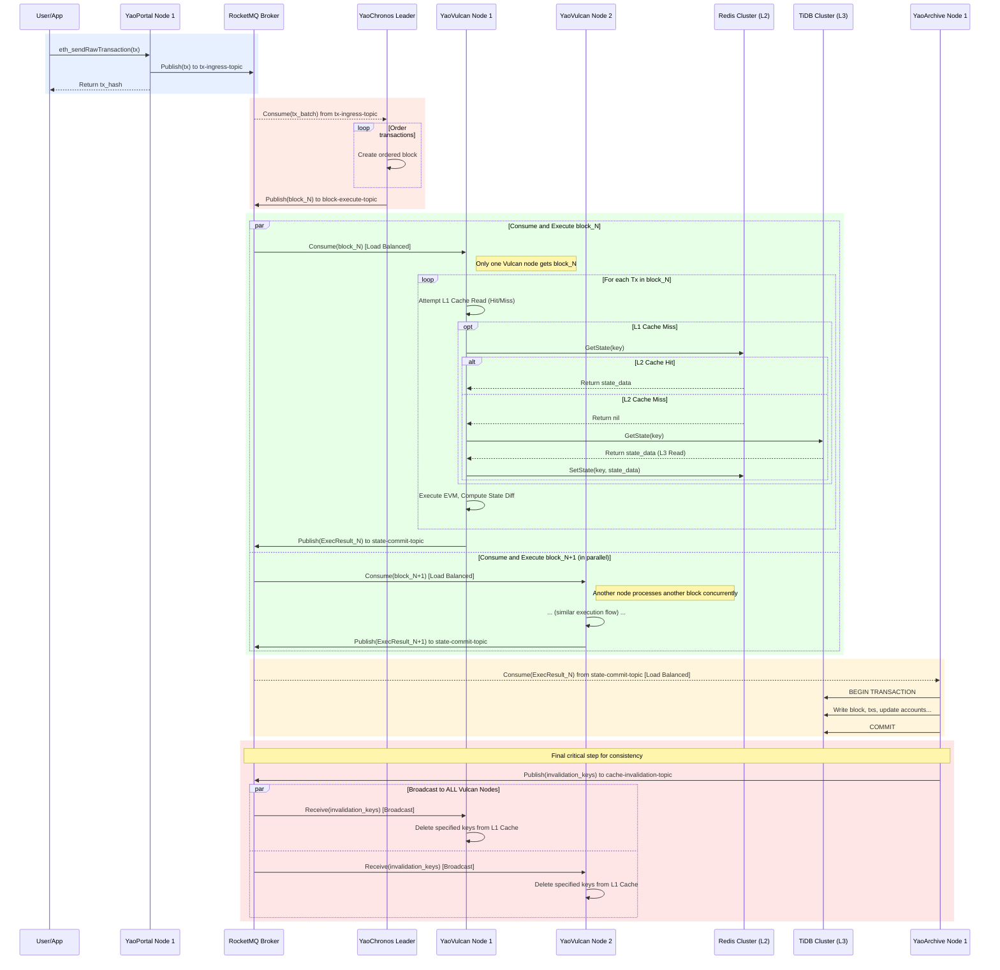

## **YaoVerse曜界 架构与实现白皮书**

### **1. 愿景与导言**

**YaoVerse (曜界)** 是一个专为受控内网环境设计的下一代区块链系统。其核心目标是突破传统区块链的性能瓶颈，提供一个兼容以太坊生态、具备极致处理能力和高可用性的中心化调度平台。

在“YaoVerse”的宇宙中，我们做出了一个根本性的架构抉择：**在完全可控和可信的环境中，以中心化的范式换取去中心化共识所无法企及的极致性能**。本系统并非为公有链或去信任环境设计，而是为那些需要区块链技术（如智能合约、可追溯性）但更看重吞吐量、低延迟和可管理性的私有化应用场景，提供一个坚实可靠的数字基座。

本文档将详细阐述YaoVerse的系统架构、核心组件职责、数据流转路径、关键技术选型以及独创的性能优化方案，为项目的开发、部署与运维提供一份清晰的实践指南。

### **2. 核心设计哲学**

YaoVerse的架构根植于以下五大设计哲学，它们共同构成了系统高性能与高可靠性的基石：

1.  **中心化信任 (Centralized Trust)**: 在所有节点均可信的私有环境中，我们摒弃了复杂的拜占庭容错（BFT）共识算法。系统的确定性与一致性由唯一的 **中心化序列器 (YaoChronos)** 保障，从而根除了共识过程中的网络开销与计算冗余，这是性能飞跃的根本前提。

2.  **职责分离 (Separation of Duties)**: 系统被解耦为一系列微服务化的组件，各自承担独立的职责：交易接收、排序、执行和持久化。这些组件通过高性能消息队列异步协作，形成了一条高效的流水线，极大地提升了系统的并行处理能力和可扩展性。

3.  **计算与存储分离 (Compute-Storage Separation)**: 执行节点 **(YaoVulcan)** 被设计为无状态单元。它们负责处理计算密集型的交易执行任务，而系统的“世界状态”则统一由分布式数据库 **(TiDB)** 进行持久化。这种分离使得计算资源可以根据负载独立、快速地进行水平扩展，而无需关心状态数据的迁移与同步。

4.  **消息驱动 (Message-Driven)**: **RocketMQ** 消息队列是贯穿整个系统的“神经网络”。所有核心流程——从交易注入、区块分发、状态提交到**缓存失效通知**——都由消息驱动。这种异步模型不仅解耦了服务，还为系统带来了强大的削峰填谷能力。

5.  **简化存储 (Simplified Storage)**: 我们彻底抛弃了以太坊原生的MPT树磁盘结构和LevelDB。所有区块链数据，包括区块、交易、回执和世界状态，都被建模为关系型表结构，并存储在 **TiDB** 中。这不仅极大地简化了数据的读写逻辑，还赋予了系统强大的、支持标准SQL的复杂查询能力。

### **3. 系统架构与操作流程**

YaoVerse的宏伟蓝图构建于Kubernetes之上，以确保所有组件的高可用性、可伸缩性和易管理性。本章节将通过两幅核心图表——系统架构图与端到端操作流程图——来深度剖析系统的静态结构与动态交互。

#### **3.1. 系统架构图 (System Architecture Diagram)**

此图描绘了YaoVerse的宏观蓝图，展示了构成系统的所有核心服务和中间件，以及它们之间的数据交互路径。

##### **架构图解析**

此架构图清晰地展示了系统的分层设计与多节点部署形态：

*   **应用层 (Application Layer)**: 包含我们自研的四个核心服务。为了便于理解，图中明确展示了每个服务集群（如`YaoPortal Cluster`, `YaoVulcan Cluster`）均由多个独立运行的节点组成。`YaoChronos`则以其高可用的`Leader/Follower`模式呈现。`YaoVulcan`被特别注明其内部集成了`YaoOracle`状态库。
*   **消息与缓存层 (Messaging & Caching Layer)**: 这是系统高性能的保障。RocketMQ负责异步解耦，并通过四个不同的Topic承载不同的业务流。其中`cache-invalidation-topic`被特别高亮，以强调其广播模式。Redis集群作为所有`YaoVulcan`节点共享的L2缓存。
*   **持久化层 (Persistence Layer)**: TiDB集群作为系统唯一的数据真理来源。

##### **数据流路径详解 (由数字标记)**：

1.  **交易提交**: 用户交易通过负载均衡被发送至任意一个`YaoPortal`节点，节点校验后将交易快速推入`tx-ingress-topic`。
2.  **交易消费**: 唯一的`YaoChronos` Leader节点从`tx-ingress-topic`中消费待处理的交易。
3.  **区块发布**: `YaoChronos`将排序好的交易打包成区块，发布到`block-execute-topic`。
4.  **区块消费 (负载均衡)**: RocketMQ以**集群消费**模式将`block-execute-topic`中的区块分发给`YaoVulcan`集群。这意味着**一个区块只会被一个**`YaoVulcan`节点消费，从而实现任务的并行处理。
5.  **状态读取 (多级缓存)**: 在执行期间，`YaoVulcan`通过其内置的`YaoOracle`库读取状态。
    *   **5a**: 优先访问L1本地缓存（图中未画出，因其在组件内部）。若L1未命中，则访问共享的L2 Redis集群。
    *   **5b**: 若L2仍未命中，最终穿透至L3 TiDB集群查询。数据返回时会逐级填充L2和L1缓存。
6.  **结果发布**: 执行完成后，`YaoVulcan`节点将包含State Diff的执行结果发布到`state-commit-topic`。
7.  **结果消费 (负载均衡)**: `YaoArchive`集群同样以**集群消费**模式消费执行结果，实现持久化任务的负载均衡。
8.  **持久化**: `YaoArchive`节点将数据原子性地写入TiDB。
9.  **失效通知发布**: 在写入成功后，`YaoArchive`节点向`cache-invalidation-topic`发布需要失效的缓存键列表。
10. **失效通知广播 (关键步骤)**: RocketMQ以**广播模式**将失效消息推送给**所有**订阅该Topic的`YaoVulcan`节点，触发它们精确地清理自己的L1本地缓存，确保数据一致性。

#### **3.2. 端到端操作流程图 (End-to-End Operational Flow Diagram)**

此图使用时序图（Sequence Diagram）来展示一笔交易从诞生到尘埃落定的完整生命周期，聚焦于组件间的动态交互和时序关系，并明确了集群中多个实例的并行行为。

##### **时序图解析**

该时序图详细分解了五个核心阶段：

*   **阶段1: 交易提交 (Transaction Submission)**: 用户提交交易，`YaoPortal`将其快速卸载到RocketMQ后立即响应，实现高吞吐。
*   **阶段2: 排序 (Sequencing)**: `YaoChronos`作为唯一的权威，消费待处理的交易并创建有序区块，确保了系统的确定性。
*   **阶段3: 并行执行 (Parallel Execution)**: 这是系统可扩展性的体现。通过`par`并行块展示了`YaoVulcan_1`和`YaoVulcan_2`如何同时处理不同的区块。图中详细描绘了多级缓存的查找逻辑：`L1 -> L2 (Redis) -> L3 (TiDB)`，并使用`alt`和`opt`块清晰展示了分支条件。
*   **阶段4: 持久化 (Persistence)**: `YaoArchive_1`节点从队列中获取一个执行结果，并以事务方式保证数据写入TiDB的原子性。
*   **阶段5: 缓存失效 (Cache Invalidation)**: 这是我们自研机制的核心。`YaoArchive`在持久化后，立即发布失效通知。图中的`par`并行块清晰地展示了该消息如何被**广播**给集群中**所有**的`YaoVulcan`节点（`Vulcan_1`和`Vulcan_2`都收到了相同的消息），确保了所有节点的L1本地缓存能够实时、一致地更新。

### **4. 核心组件深度解析**

#### **4.1. YaoPortal (曜阙) — API网关**

*   **寓意**: Portal 代表“通向新世界的传送门”，“阙”在古代象征帝王宫殿的门户。它是链上宇宙的星门，所有请求的唯一入口。
*   **核心职责**:
    *   **以太坊兼容接口**: 对外提供标准的JSON-RPC接口，如 `eth_sendRawTransaction`, `eth_call` 等，确保与现有以太坊生态工具无缝兼容。
    *   **请求卸载**: 接收交易后，仅进行基础校验，立即推送到RocketMQ的 `tx-ingress-topic`，并快速响应客户端，使其能应对极高的并发写入。
    *   **只读请求路由**: 处理 `eth_call` 等只读请求时，通过`YaoVulcan`内置的`YaoOracle`库进行查询，不进入交易排序流程。

#### **4.2. YaoChronos (曜史) — 中心化序列器**

*   **寓意**: Chronos是希腊神话中的时间之神，掌控一切顺序。“史”象征着它在编织宇宙的历史脉络。
*   **核心职责**:
    *   **全局唯一排序**: 作为系统的“心脏”，它是唯一负责为交易排序的组件，从`tx-ingress-topic`中批量拉取交易。
    *   **交易打包**: 将一批有序交易打包成一个简化的“区块”结构。
    *   **分发任务**: 将打包好的区块发送到`block-execute-topic`，供下游消费。**YaoChronos的吞吐能力，直接决定了整个YaoVerse系统的TPS上限**。
*   **高可用实现**: 采用 **Leader-Follower模式**，通过Kubernetes `Lease`对象实现领导者选举，确保服务连续性。

#### **4.3. YaoVulcan (曜焱) — 执行节点集群**

*   **寓意**: Vulcan是罗马神话的锻造之神，“焱”代表烈焰。一切智能合约在此燃烧、淬炼，被锻造成现实。
*   **核心职责**:
    *   **合约执行**: 内置EVM，作为消费者从`block-execute-topic`获取有序区块，并执行交易。
    *   **高效状态访问**: 通过**进程内函数调用**，访问其**内置的YaoOracle状态库**来获取世界状态。
    *   **结果生成**: 计算State Diff，生成回执，并将结果打包发送到`state-commit-topic`。
    *   **缓存同步**: 内置的`YaoOracle`库以后台任务形式，**以广播模式订阅`cache-invalidation-topic`**，接收失效通知并实时清理L1缓存。

#### **4.4. YaoArchive (曜典) — 持久化服务**

*   **寓意**: Archive是典籍与档案，“典”寓意永恒的记录。它构建了宇宙不可磨灭的记忆。
*   **核心职责**:
    *   **数据最终落地**: 作为系统中唯一对数据库进行写入的组件，它订阅`state-commit-topic`。
    *   **原子性写入**: 利用TiDB的ACID事务能力，将区块、交易、状态变更等**原子性地写入**数据库。
    *   **发布缓存失效通知**: 在数据成功入库后，根据State Diff生成包含被修改状态Key的**精确列表**，并作为消息，发送到RocketMQ的`cache-invalidation-topic`。

### **5. 核心中间件选型与介绍**

#### **5.1. TiDB 集群：分布式关系型数据库 (L3)**

*   **技术简介**: TiDB是一个开源的、兼容MySQL协议的分布式HTAP（混合事务/分析处理）数据库。它通过将数据分片（Region）并存储在多个TiKV节点上，实现了存储和计算能力的水平扩展。
*   **在YaoVerse中的角色**:
    *   **最终真相来源 (Source of Truth)**: 作为系统的唯一持久化存储，保证所有区块链数据的强一致性（ACID）。
    *   **无限扩展能力**: 随着链上数据的增长，只需增加TiKV节点即可平滑扩容，无惧状态爆炸问题。
    *   **高可用性**: 基于Raft共识协议，数据拥有多个副本，单个节点故障不会影响服务可用性。
    *   **简化数据模型**: 其关系型模型让我们能用直观的表结构（`Accounts`, `Contract_Storage`等）替代复杂的MPT树，极大简化开发并提供强大的SQL查询能力。

#### **5.2. Redis 集群：分布式共享缓存 (L2)**

*   **技术简介**: Redis是一个基于内存的高性能键值数据库，通常用作缓存、消息代理和数据库。Redis Cluster提供了分布式能力，可以将数据分片存储在多个节点上。
*   **在YaoVerse中的角色**:
    *   **数据库的保护屏障**: 作为L2缓存，它吸收了绝大多数L1缓存未命中的读请求，是保护TiDB免受高并发冲击的“最后一道防线”。
    *   **加速节点预热**: 新启动的`YaoVulcan`节点可以快速从共享的Redis中拉取热数据来填充自己的L1缓存，而不是缓慢地从TiDB加载。
    *   **实现跨节点数据共享**: 它是整个无状态执行集群的“共享热点内存”，使得一个节点预热的数据能被其他所有节点立即利用，提升了整个集群的缓存效率。

#### **5.3. RocketMQ 集群：企业级消息队列**

*   **技术简介**: Apache RocketMQ是一款低延迟、高并发、高可用、功能丰富的分布式消息中间件。
*   **在YaoVerse中的角色**:
    *   **系统解耦的生命线**: 它是连接所有核心组件的异步总线，实现了生产者和消费者之间的完全解耦。
    *   **高并发的缓冲池**: 面对突发交易洪峰，RocketMQ提供了强大的削峰填谷能力。
    *   **双重消费模式的基石**: YaoVerse创造性地同时利用了RocketMQ的两种消费模式：
        *   **集群消费 (Clustering)**: 用于`block-execute-topic`，将区块分发给任意一个空闲的`YaoVulcan`节点，实现负载均衡。
        *   **广播消费 (Broadcasting)**: 用于`cache-invalidation-topic`，确保失效通知能被**每一个**`YaoVulcan`节点接收，是实现实时缓存一致性的关键。

### **6. 独创核心技术：嵌入式状态库与实时缓存同步机制**

这是YaoVerse能够实现极致性能的“秘密武器”，是我们自研的核心创新。

#### **6.1. 设计动因：挑战极致性能的“最后一公里”**

EVM执行交易时，会产生海量、高频的状态读取请求。在传统架构中，即使是访问Redis，也意味着一次毫秒级的网络往返。当一笔复杂交易需要数百次状态读取时，累积的网络延迟将成为不可逾越的性能瓶颈。我们的目标是将这个延迟从**毫秒级**降低到**纳秒级**，征服这“最后一公里”。

#### **6.2. YaoOracle：嵌入式的三级缓存架构**

`YaoOracle`并非一个独立服务，而是一个被无缝集成到每个`YaoVulcan`进程内的智能状态库。它构建了如下的三级缓存体系：

*   **L1 - 本地内存缓存**: 使用Go-Ristretto等高性能本地缓存，直接在`YaoVulcan`的内存中。当EVM请求状态时，99%的热数据应在此命中。这是一次**纳秒级的进程内函数调用**，彻底消除了网络开销。
*   **L2 - 分布式共享缓存**: 当L1未命中时，`YaoOracle`会访问外部的Redis集群。这是一次**毫秒级的网络调用**，用于获取非本地热点数据并保护数据库。
*   **L3 - 持久化数据源**: 当L2仍未命中时，才会访问最终的TiDB数据库。这是一次**数十毫秒级的磁盘/网络调用**，用于获取冷数据。

#### **6.3. 实时缓存一致性：基于RocketMQ广播的优雅解法**

引入L1本地缓存的最大挑战是数据一致性。当`YaoArchive`更新了数据库后，所有`YaoVulcan`节点的L1缓存都变成了“脏数据”。我们的解决方案，是利用现有的RocketMQ，构建一个高效、可靠的实时同步机制：

1.  **发布真相**: `YaoArchive`在将区块N的状态成功写入TiDB后，会提取出所有被修改状态的Key（如`account-0x...`, `storage-0x...-slot...`）。
2.  **精确广播**: 它将这个精确的Key列表作为一条消息，发布到`cache-invalidation-topic`。该Topic被配置为**广播模式**。
3.  **订阅与失效**: 每个`YaoVulcan`进程中的`YaoOracle`库，都有一个后台goroutine订阅此Topic。收到消息后，它会以“外科手术”般的精度，只从其L1缓存中删除列表中指定的Key。

#### **6.4. 综合优势**

*   **极致性能**: L1缓存将绝大多数状态访问延迟降至纳秒级，为EVM全速运行扫清了最大障碍。
*   **架构简洁**: 复用RocketMQ实现缓存同步，避免了引入Redis Pub/Sub等额外的技术栈，降低了系统复杂度和运维成本。
*   **高可用与弹性**: 该机制是完全分布式的。`YaoVulcan`节点的增减、重启，都不会影响整个缓存同步体系的正常运作。
*   **职责明确**: 缓存的填充（读时）和失效（写后）逻辑分离，清晰地遵循了CQRS（命令查询职责分离）的思想。

### **7. 结论**

**YaoVerse (曜界)** 架构通过拥抱中心化调度，并深度整合云原生技术栈，重塑了高性能区块链的实现范式。其独创的**嵌入式多级缓存状态库 (YaoOracle)** 与**基于RocketMQ广播的实时缓存同步机制**，协同解决了状态访问延迟与数据一致性的核心矛盾。

这使得YaoVerse在牺牲无需的去中心化特性的前提下，为可控的私有链场景换来了梦寐以求的极致性能、高并发处理能力与卓越的系统可维护性，是构建下一代高性能企业级区块链应用的理想基石。